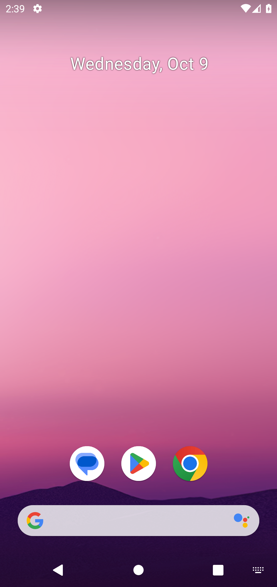

# Environment Installation Guide 

We recommend using the Linux environment. Support to Windows and MacOS are not provided, but we welcome contributions.

## Android Software Development Kit (SDK)

Part of this tutorial is based on this [GitHub Gist](https://gist.github.com/nhtua/2d294f276dc1e110a7ac14d69c37904f) and [official SDK tool](https://github.com/codepath/android_guides/wiki/installing-android-sdk-tools) 

### Install Java (JDK 8)

Download a Java Development Kit 8 (v1.8.0) release version from the open-source Java releaser [OpenLogic](https://www.oracle.com/java/technologies/downloads/). Install using your Linux package installer, like `apt` or `rpm`. For example, on a Debian server:

```bash
sudo apt-get update
cd ~ && mkdir install-android/ && cd install-android
wget https://builds.openlogic.com/downloadJDK/openlogic-openjdk/8u412-b08/openlogic-openjdk-8u412-b08-linux-x64-deb.deb
sudo apt install ./openlogic-openjdk-8u412-b08-linux-x64-deb.deb
```

If you already has a java binary previously, you should also do this:

```bash
sudo update-alternatives --config java # select /usr/lib/jvm/openlogic-openjdk-8-hotspot-amd64/bin/java
```

Check whether the installation is successful by `java -version`. You should expect the output shows version 1.8.0. Higher versions makes `sdkmanager` crash.

```bash
java -version
# openjdk version "1.8.0_412-412"
# OpenJDK Runtime Environment (build 1.8.0_412-412-b08)
# OpenJDK 64-Bit Server VM (build 25.412-b08, mixed mode)
```

### Install SDK Manager

Download the Android SDK for Linux from the [official website](https://developer.android.com/studio/index.html#downloads). For your convenience, you can also directly download the [installation package](https://dl.google.com/android/repository/sdk-tools-linux-4333796.zip).

```bash
wget https://dl.google.com/android/repository/sdk-tools-linux-4333796.zip
```

Now specify the android installation path and unzip the installation package to that path. It's recommended to use `/home/<username>/.android` as the default installation path.

```bash
export ANDROID_HOME=<intended_path_here> # recommended: /home/<username>/.android
mkdir -p $ANDROID_HOME
unzip sdk-tools-linux-4333796.zip -d $ANDROID_HOME
```

Make sure you have `unzip` installed. For example, use `sudo apt install unzip -y` to install on Debian servers. To check whether the unzip is successful:

```bash
ls $ANDROID_HOME
# tools
```

### SDK Emulator

Prior to install the SDK emulators, set the environment variables:

```bash
echo "export ANDROID_HOME=$ANDROID_HOME" >> ~/.bashrc
echo 'export SDK=$ANDROID_HOME' >> ~/.bashrc
echo 'export ANDROID_SDK_ROOT=$ANDROID_HOME' >> ~/.bashrc
echo 'export PATH=$SDK/emulator:$SDK/tools:$SDK/tools/bin:$SDK/platform-tools:$PATH' >> ~/.bashrc
source ~/.bashrc
```

Now you should be able to locate the `sdkmanager` binary:

```bash
which sdkmanager
# .../tools/bin/sdkmanager
```

Then install the Android emulator 28 (other versions should also work, but the offline data we provided is in version 28):

```bash
yes | sdkmanager "platform-tools" "platforms;android-30" "emulator"
yes | sdkmanager "system-images;android-30;google_apis_playstore;x86_64"
yes | sdkmanager "build-tools;28.0.0"
```

## Android Virtual Device (AVD) Initialization

In the next step, we create an AVD image as the environment. Part of this tutorial is based on this [AVD setup](https://developer.android.com/studio/run/managing-avds)
### Device Creation

Download the device image (android_30.zip) [here](https://drive.google.com/drive/folders/1HzLPB2X2oXTaYKOuOji_3VDqfHhUfYX7?usp=sharing).

Unzip the device image to `$ANDROID_HOME/avd`.

```bash
cd $ANDROID_HOME
mkdir avd
cd avd
unzip android_30.zip
```

Download the `adbkey` [here](https://drive.google.com/drive/folders/1HzLPB2X2oXTaYKOuOji_3VDqfHhUfYX7?usp=sharing) to `$ANDROID_HOME`.

If you previously had an `adbkey` and updated it, make sure to restart the adb server:

```bash
adb kill-server
adb start-server
```

You have now successfully copied the AVD based on android-30 that we used for our research.

### KVM Acceleration

In order to launch the emulator, check whether `kvm` is reachable on your machine. Simply run this command to check:

```bash
ls /dev/kvm
# /dev/kvm -> you have KVM support
# ls: cannot access '/dev/kvm': No such file or directory -> you don't have KVM support
```

If you don't have KVM support, try to enable it. During our experiments, we find that KVM virtualization makes the emulator at least 5x faster (in all aspects, including bootstrapping and interactions). **Again, failure to set up KVM is likely to backfire your research by significantly increasing the interaction time during reinforcement learning.** You can check whether you can virtualize your machine via

```bash
sudo apt-get install cpu-checker
sudo kvm-ok # yes means your machine supports virtualization
```

If your machine doesn't support virtualization, first enable this feature (this can be enabled on most virtual server providers). On GCP, for example, refer to [this guide](https://cloud.google.com/compute/docs/instances/nested-virtualization/enabling). To best of our knowledge, AWS only allows virtualization on bare metal machines, so try to set up bare metals for this research.

After checking that your machine supports virtualization, enable KVM by referring to [this guide](https://developer.android.com/studio/run/emulator-acceleration#vm-linux). If you have done all steps in this guide and you still can't set up KVM, try rebooting your machine.

### Device Bootstrapping

Now check whether you can successfully run an AVD instance with KVM acceleration by starting an emulator:

```bash
emulator -avd android_30 "-no-window" "-no-audio" "-skip-adb-auth" "-no-boot-anim" "-gpu" "auto" "-no-snapshot-load" "-feature" "-Vulkan"
# ...
# Cold boot: requested by the user
# INFO    | Boot completed in 12579 ms
```

A successful launch should show `Cold boot: requested by the user` in the end. Now open a new terminal tab, you should be able to see an online devices through `adb`:

```bash
adb devices
# List of devices attached
# emulator-5554   device
```

## Final Step: AVD Snapshot for Quickboot

Now we create an AVD snapshot for quickboot. This avoids bootstrapping the device every time we launch it by saving a bootstrapped snapshot.

### Create Snapshot

Execute the screenshot script:

```bash
python <path_to_distrl_repo>/scripts/screenshot.py
# screenshot saved to <current_path>/test.png
```

You should now see a screenshot like this: 



Now go back to the emulator terminal tab. Use `ctrl+c` to exit the emulator, and you should see 

```bash
ctrl+c
# INFO    | Saving with gfxstream=1
# ERROR   | stop: Not implemented
```

### Load Snapshot

Now execute this command to check whether the snapshot is successfully saved:

```bash
emulator -avd android_30 "-no-window" "-no-audio" "-skip-adb-auth" "-no-boot-anim" "-gpu" "auto" "-no-snapshot-save" "-feature" "-Vulkan"
# Successfully loaded snapshot 'default_boot'
```

Congratulations! You're good to go now. Close all tabs and move on the main README for the experiments.
